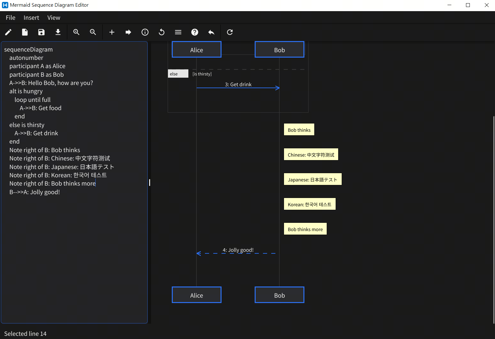
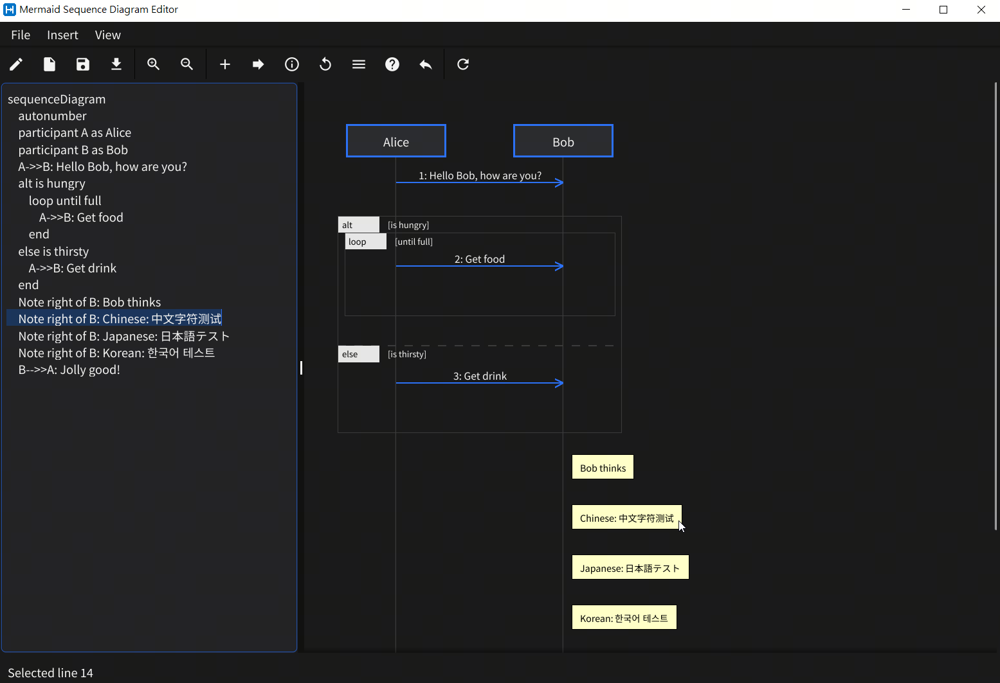
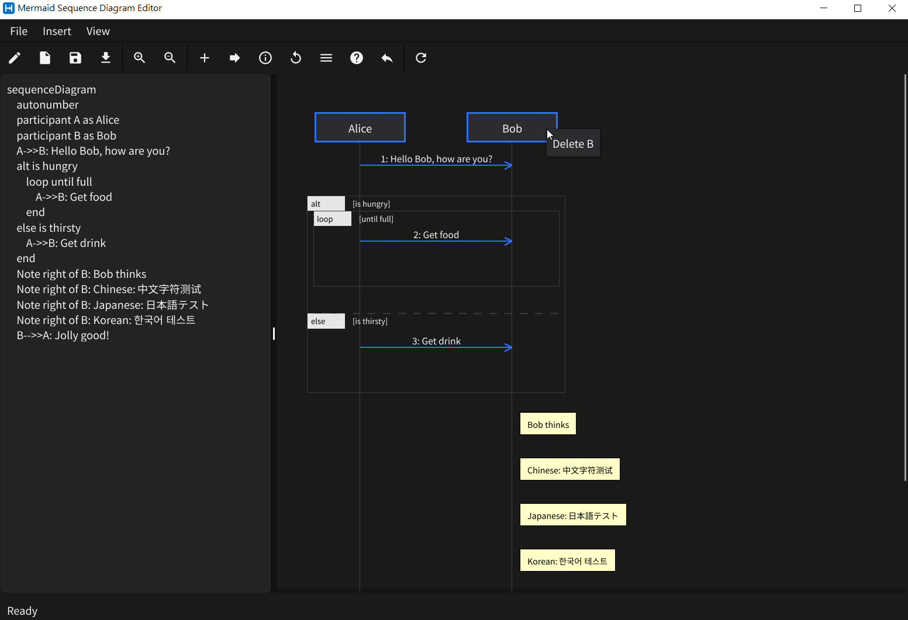

# Mermaid Sequence Diagram GUI (mermaid-sq-gui)

A lightweight, interactive Fyne-based desktop application for creating, editing, and exporting Mermaid sequence diagrams.


## New & Updated Features

1.  **Sticky Participants Header**: When scrolling down in long diagrams, the participant boxes remain pinned to the top of the view for easy reference.
    
2.  **Automatic Block Cleanup**: Empty 'alt', 'else', and 'loop' blocks are automatically removed from the Markdown text when they no longer cover any active participants.
3.  **Full Main Menu Bar**: Integrated File, Insert, and View menus for faster access to all application features.
4.  **Smart Block Rendering**: Nested blocks (alt, loop, opt) automatically calculate their horizontal span based on the participants involved.
5.  **Adaptive Performance**: Automatically optimizes CPU usage by setting `GOMAXPROCS` to `(nproc - 2)` for smooth background rendering.
6.  **UI Scaling Detection**: Cross-platform OS scale detection (including WSLg support) ensures the UI looks crisp on all displays. View details via **File > UI Scaling Info**.
    - **Manual Override**: Set the `FYNE_SCALE` environment variable to force a specific scale (e.g., `FYNE_SCALE=1.5`).
7.  **Interactive Zoom Controls**: Manually adjust the diagram's internal scale using "Zoom In" and "Zoom Out" from the menu or toolbar (0.1x to 3.0x).
8.  **Live Preview**: Instant rendering of Mermaid sequence diagram code as you type.
9.  **Interactive Selection**: Click on diagram elements to jump to the corresponding line in the editor.
    
10. **Participant Management**: Right-click a participant box to delete it and all its related messages/notes.
    
11. **Ink-Saving PNG Export**: High-fidelity, print-optimized PNG export with automatic color correction for white backgrounds and support for bold CJK fonts.
12. **Unicode Support**: Full support for multi-language text (CJK) using bundled **Noto Sans CJK KR** fonts, ensuring consistent rendering across all platforms.
13. **Manual Path Entry Dialogs**: Enter absolute file paths directly or use standard file browsing for robust cross-platform file saving/loading, with automatic sanitization for backslashes and special characters.

## Build Commands (optimized for WSL/Linux)

Ensure you have Go 1.21+ and Fyne dependencies installed.

### Linux (native or WSL)
```bash
NPROC=$(nproc); GOMAX=$((NPROC > 2 ? NPROC - 2 : 1)); go build -v -p $GOMAX -o mermaid-sq-gui .
```

### Windows (cross-compile from WSL/Linux)
```bash
NPROC=$(nproc); GOMAX=$((NPROC > 2 ? NPROC - 2 : 1)); GOOS=windows GOARCH=amd64 CGO_ENABLED=1 CC=x86_64-w64-mingw32-gcc go build -v -p $GOMAX -ldflags="-s -w -extldflags=-static -H=windowsgui" -o mermaid-sq-gui.exe .
```

### macOS
```bash
go build -o mermaid-sq-gui .
```

## How to Set UI Scaling (FYNE_SCALE)

If the automatic scaling detection does not suit your display, you can manually override it using the `FYNE_SCALE` environment variable.

### Linux/WSL/macOS (Command Line)
```bash
FYNE_SCALE=1.5 ./mermaid-sq-gui
```

### Windows (PowerShell)
```powershell
$env:FYNE_SCALE=1.5; .\mermaid-sq-gui.exe
```

### Windows (Command Prompt)
```cmd
set FYNE_SCALE=1.5 && mermaid-sq-gui.exe
```

## How to Use

1.  **Editing**: 
    - Type Mermaid code in the left panel.
    - Use the **Insert** menu or toolbar to quickly add snippets.
2.  **Navigation & Scaling**:
    - Scroll the right panel to view large diagrams.
    - Use the **Zoom** buttons in the toolbar to adjust the diagram size.
    - The participant header will follow you as you scroll down.
3.  **Integration**:
    - Click any arrow, note, or block header to highlight its source code.
    - Right-click participants to manage the diagram structure.

## Dependencies

- Fyne v2.7.3
- Go 1.21+

## System Requirements

- **Operating System**: Windows, Linux, or macOS.
- **Compiler**: Requires a C compiler (gcc) for Fyne/Go compilation.
- **Bundled Fonts**: Uses Noto Sans CJK KR (Regular & Bold) for consistent cross-platform Unicode support.

Built for developers who need a fast, local way to design sequence diagrams without relying on web-based editors.
